共享单车后台管理系统
==================
一、项目使用技术：
============
此项目基于webpack脚手架初始化，基于React的UI框架-AntD组件开发，使用Yarn包管理工具，其中用到了React的基础知识、生命周期函数、Router4.0
--------------------------
，终极版集成开发等做出反应全家桶知识。还使用了简易模拟平台自定义JSON数据接口，百度天气接口，百度地图接口。
-----------------------------------------------------------------------------------------------------
二、项目核心
===========
1.使用的核心库有React16，Router4.0，终极版
----------------------------------------
2.使用的中间键有爱可信，地图，ECharts，AntD等插件，通过连接简易模拟本地接口，实现数据的加载。
------------------------------------------------------------------------------
3.封装的公共机制有JSONP，Axios公司，载入加载，ETABLE，电子表格等
-------------------------------------------------------------
三、项目展示
============ 
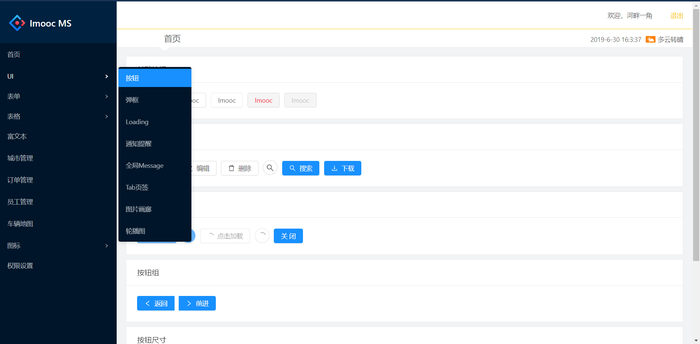 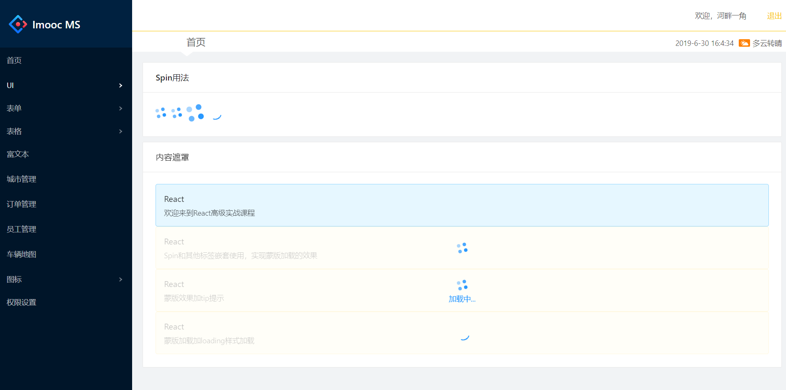
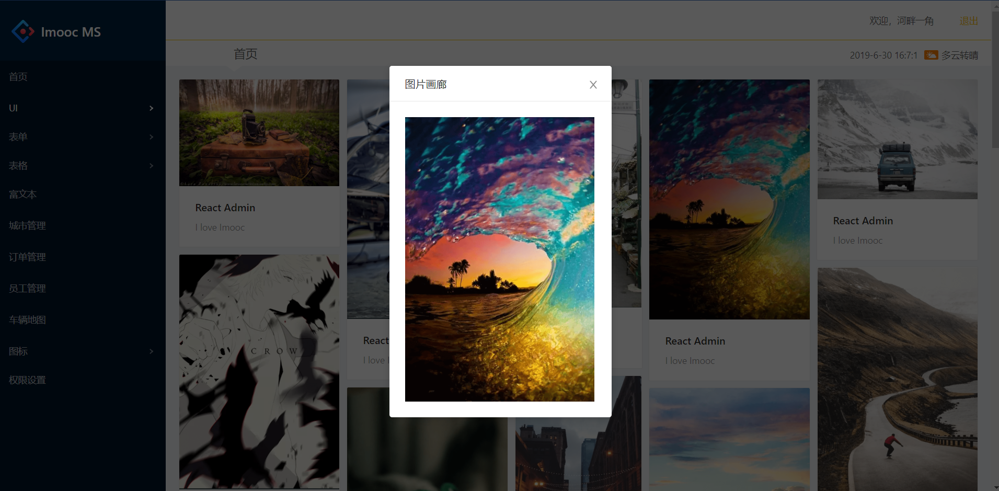 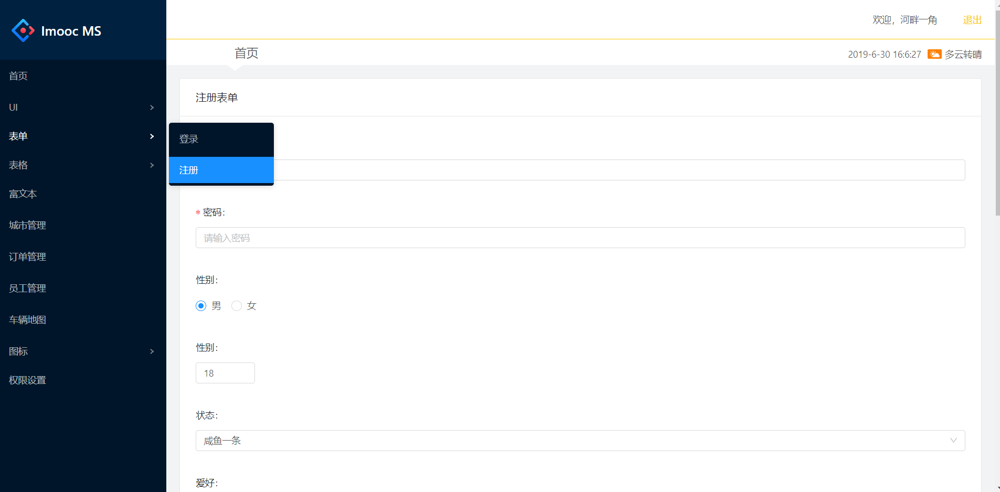
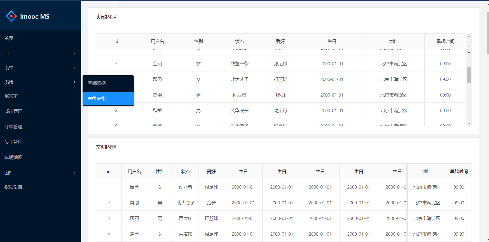 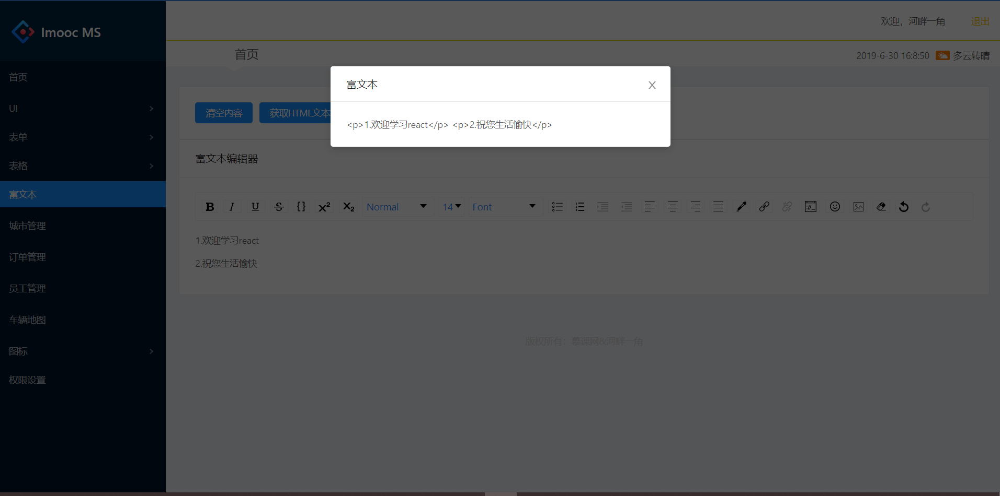
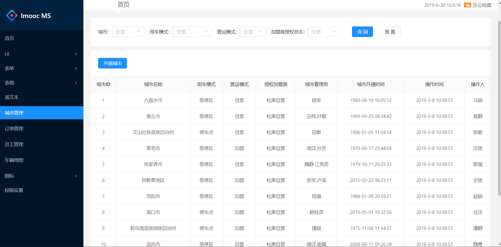 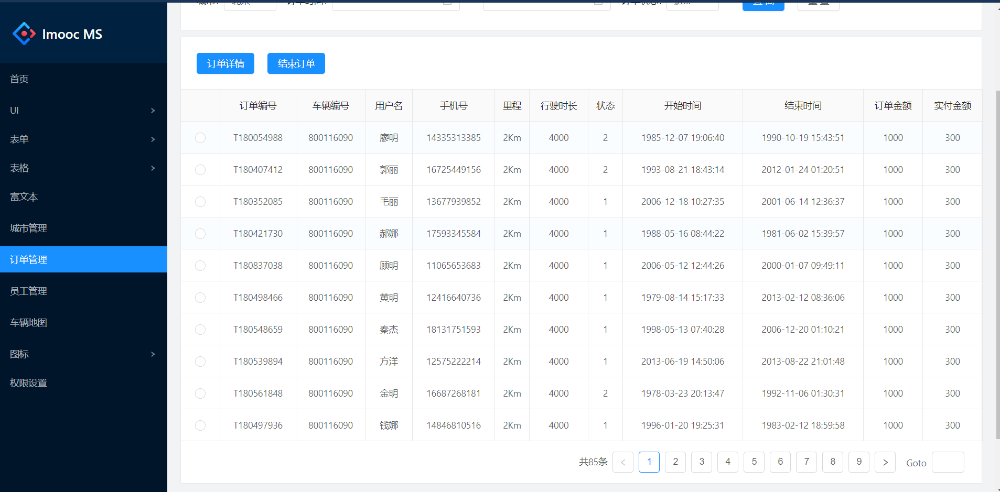
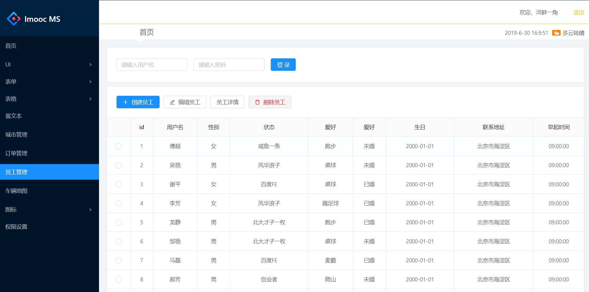 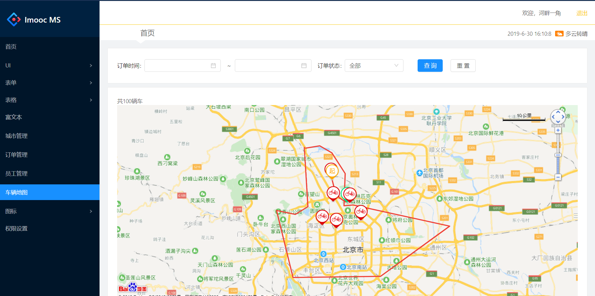
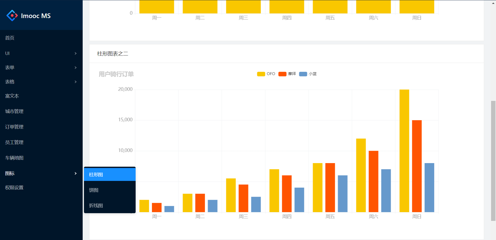 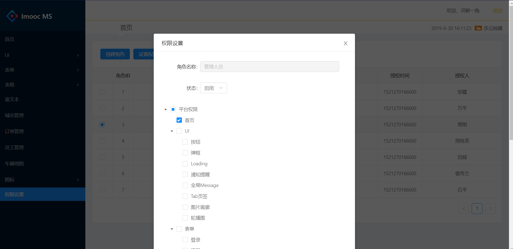

